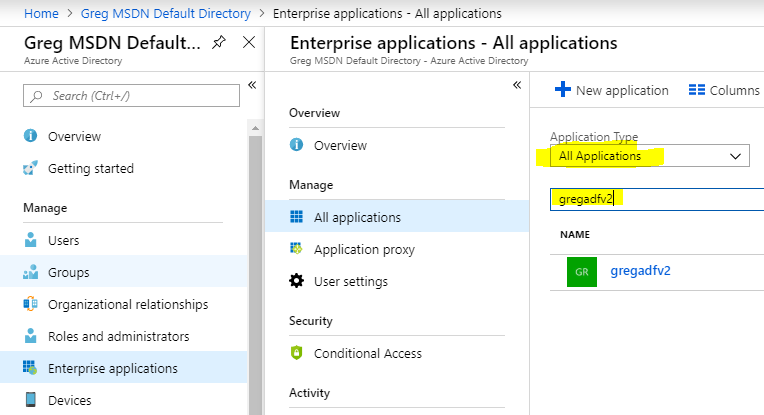

# Automating Azure Analysis Services - Code Samples
My [SQL Saturday presentation](http://www.sqlsaturday.com/734/Sessions/Details.aspx?sid=77768) (slides [download](http://www.sqlsaturday.com/SessionDownload.aspx?suid=20659)) included demos of various ways to automate Azure Analysis Services. These code samples are included here.

A video recording of the session is available courtesy of [UserGroup.tv](http://usergroup.tv/videos/automating-azure-analysis-services).

### [PauseIfNoQueries](https://github.com/furmangg/automating-azure-analysis-services/tree/master/PauseIfNoQueries)

The PauseIfNoQueries/PauseAzureAnalysisServicesIfNoQueries.ps1 is a PowerShell script that is designed to run in an Azure Automation runbook that runs on a schedule. It does the following:

1. Connects with the Azure Automation RunAs account to confirm your Azure AS server is running
2. Installs [ADOMD.NET v15](https://www.nuget.org/packages/Microsoft.AnalysisServices.AdomdClient.retail.amd64/) from NuGet
3. Runs a DISCOVER_SESSIONS DMV to determine if any queries are running
4. If no queries are running it pauses Azure Analysis Services

The following modules must be imported to your Azure Automation account: 
* AzureRM.AnalysisServices
* PackageManagement

The Azure Automation RunAS identity must have admin permissions in SSAS. This is not accomplished through the Azure portal but through SQL Server Management Studio as described [here](https://azure.microsoft.com/en-us/blog/automation-of-azure-analysis-services-with-service-principals-and-powershell/).

Note: This solution will not properly detect all running queries if you have setup replicas in your Azure Analysis Services.

### [ADFv2](https://github.com/furmangg/automating-azure-analysis-services/tree/master/ADFv2)

In order to use these samples, in ADF create a new pipeline, then rename it to the name of the sample pipeline. In the top right, click the Code button then copy and paste the raw JSON into the ADF code window and click OK.

#### ResumeAzureAS

The "[ADFv2/ResumeAzureAS MSI.json](https://raw.githubusercontent.com/furmangg/automating-azure-analysis-services/master/ADFv2/ResumeAzureAS%20MSI.json)" file contains an Azure Data Factory v2 pipeline which is able to resume Azure AS looping until the resume is complete. It uses only Web Activities. There are no dependencies on .NET custom activities or Azure Logic Apps or SSIS. This version uses the ADF Managed Service Identity (MSI). This approach is recommended over the non-MSI version below.

Set the following parameters upon execution of the pipeline:
* **TenantID** - The GUID identifier for your Azure Active Directory (AAD) tenant. In the Azure Portal go to the Azure Active Directory tab and the Properties tab and copy the Directory ID property.
* **SubscriptionID** - The GUID identifier for the subscription the Azure Analysis Services instance is running from. To get this ID, go to the Subscriptions tab of the Azure Portal.
* **ResourceGroup** - The name of the resource group where the Azure Analysis Services instance lives.
* **Server** - The name of your Azure Analysis Services instance. This is not the full asazure:// URI. This is just the final section saying the name of your server.

The ADF MSI must be granted contribute permissions in the Access Control (IAM) in the Azure Analysis Services. Typing in the name of the ADF will usually find the MSI but if not see the MSI instructions below.

The "[ADFv2/ResumeAzureAS.json](https://raw.githubusercontent.com/furmangg/automating-azure-analysis-services/master/ADFv2/ResumeAzureAS.json)" file contains an Azure Data Factory v2 pipeline which is able to resume Azure AS looping until the resume is complete. It uses only Web Activities. There are no dependencies on .NET custom activities or Azure Logic Apps or SSIS.

Set the following parameters upon execution of the pipeline:
* **TenantID** - The GUID identifier for your Azure Active Directory (AAD) tenant. In the Azure Portal go to the Azure Active Directory tab and the Properties tab and copy the Directory ID property.
* **ClientID** - The GUID identifier for the AAD application (sometimes called service principal). The ClientID is sometimes called the ApplicationID. In the Azure Portal go to the Azure Active Directory tab, the App Registrations tab, if you don't see the application in question, choose All apps from the dropdown. Click the application in question and copy the Application ID from the app's blade. If you haven't created the app yet, then follow these [instructions](https://docs.microsoft.com/en-us/azure/azure-resource-manager/resource-group-create-service-principal-portal).
* **ClientSecret** - The secret key used to authenticate the AAD application. See these [instructions](https://docs.microsoft.com/en-us/azure/azure-resource-manager/resource-group-create-service-principal-portal) for how to create the app and the key.
* **SubscriptionID** - The GUID identifier for the subscription the Azure Analysis Services instance is running from. To get this ID, go to the Subscriptions tab of the Azure Portal.
* **ResourceGroup** - The name of the resource group where the Azure Analysis Services instance lives.
* **Server** - The name of your Azure Analysis Services instance. This is not the full asazure:// URI. This is just the final section saying the name of your server.

The AAD application must be granted contribute permissions in the Access Control (IAM) in the Azure Analysis Services.

#### ProcessAzureAS

The "[ADFv2/ProcessAzureAS MSI.json](https://raw.githubusercontent.com/furmangg/automating-azure-analysis-services/master/ADFv2/ProcessAzureAS%20MSI.json)" file shows how to perform a full refresh of the data inside an Azure Analysis Services model. Unlike other solutions which leverage external services like Azure Logic Apps or custom ADF .NET activities running in Azure Batch, this approach uses only built-in activities which depend on no external services other than Azure Analysis Services. This version uses the ADF Managed Service Identity (MSI). This approach is recommended over the non-MSI version below.

Set the following parameters upon execution of the pipeline:
* **TenantID** - The GUID identifier for your Azure Active Directory (AAD) tenant. In the Azure Portal go to the Azure Active Directory tab and the Properties tab and copy the Directory ID property.
* **SubscriptionID** - The GUID identifier for the subscription the Azure Analysis Services instance is running from. To get this ID, go to the Subscriptions tab of the Azure Portal.
* **Region** - The name of the region (e.g. southcentralus) where the Azure Analysis Services instance lives. This region is used as the beginning of the asazure:// server name for your server.
* **Server** - The name of your Azure Analysis Services instance. This is not the full asazure:// URI. This is just the final section saying the name of your server.
* **DatabaseName** - The name of the database in Azure Analysis Services you wish to process.

The ADF MSI must have admin permissions in SSAS. This is not accomplished through the Azure portal but through SQL Server Management Studio as described [here](https://azure.microsoft.com/en-us/blog/automation-of-azure-analysis-services-with-service-principals-and-powershell/).

To get the ADF MSI ID, go to your Azure Data Factory blade and the Properties tab. Copy the Managed Identity Application ID value and the Managed Identity Tenant value.

Combine these two IDs together as follows and add this "user" as an Analysis Services administrator in SSMS as described [here](https://azure.microsoft.com/en-us/blog/automation-of-azure-analysis-services-with-service-principals-and-powershell/).

    app:<ApplicationID>@<TenantID>

The [ADFv2/ProcessAzureAS.json](https://raw.githubusercontent.com/furmangg/automating-azure-analysis-services/master/ADFv2/ProcessAzureAS.json) file shows how to perform a full refresh of the data inside an Azure Analysis Services model. Unlike other solutions which leverage external services like Azure Logic Apps or custom ADF .NET activities running in Azure Batch, this approach uses only built-in activities which depend on no external services other than Azure Analysis Services. _This sample was updated May 2019 to simplify it and remove the dependency on an HTTP linked service and dataset._

Set the following parameters upon execution of the pipeline:
* **TenantID** - The GUID identifier for your Azure Active Directory (AAD) tenant. In the Azure Portal go to the Azure Active Directory tab and the Properties tab and copy the Directory ID property.
* **ClientID** - The GUID identifier for the AAD application (sometimes called service principal). The ClientID is sometimes called the ApplicationID. In the Azure Portal go to the Azure Active Directory tab, the App Registrations tab, if you don't see the application in question, choose All apps from the dropdown. Click the application in question and copy the Application ID from the app's blade. If you haven't created the app yet, then follow these [instructions](https://docs.microsoft.com/en-us/azure/azure-resource-manager/resource-group-create-service-principal-portal).
* **ClientSecret** - The secret key used to authenticate the AAD application. See these [instructions](https://docs.microsoft.com/en-us/azure/azure-resource-manager/resource-group-create-service-principal-portal) for how to create the app and the key.
* **SubscriptionID** - The GUID identifier for the subscription the Azure Analysis Services instance is running from. To get this ID, go to the Subscriptions tab of the Azure Portal.
* **Region** - The name of the region (e.g. southcentralus) where the Azure Analysis Services instance lives. This region is used as the beginning of the asazure:// server name for your server.
* **Server** - The name of your Azure Analysis Services instance. This is not the full asazure:// URI. This is just the final section saying the name of your server.
* **DatabaseName** - The name of the database in Azure Analysis Services you wish to process.

The AAD application must have admin permissions in SSAS. This is not accomplished through the Azure portal but through SQL Server Management Studio as described [here](https://azure.microsoft.com/en-us/blog/automation-of-azure-analysis-services-with-service-principals-and-powershell/).

### [LinkedServer](https://github.com/furmangg/automating-azure-analysis-services/tree/master/LinkedServer)

Connecting to Azure Analysis Services with a SQL Server linked server enables a number of scenarios:

* Loading into SQL Server the results from a DMV (dynamic management view) to extract lists of measures or tables
* Loading into SQL Server the results from a MDX or DAX query
* Executing TMSL commands to refresh the data in Azure Analysis Services models

The "LinkedServer/SQL Linked Server to Azure Analysis Services.sql" file shows an example of the linked server setup and how to use it.

### [SSIS](https://github.com/furmangg/automating-azure-analysis-services/tree/master/SSIS)

If your ETL is orchestrated in SQL Server Integration Services, it is only natural to refresh your Azure Analysis Services models using SSIS. We prefer C# script tasks for cube processing over the Analysis Services Processing command because the Analysis Services Processing command hardcodes the SSAS database at design time while the C# code can process the database identified in the connection string such that runtime configuration can cause it to process a different database.

* **SSIS/ProcessAzureAS-UsernamePassword.dtsx** - An SSIS package which authenticates using a username and password (which does not have multi-factor auth enabled) and performs a full refresh of the model. This package uses a C# script task. Follow the instructions in the annotation once you open the SSIS package.
* **SSIS/ProcessAzureAS-App.dtsx** - An SSIS package which authenticates using an AAD application (ClientID and secret). This package uses a C# script task. Follow the instructions in the annotation once you open the SSIS package.

### [BackupRestore](https://github.com/furmangg/automating-azure-analysis-services/tree/master/BackupRestore)

The BackupRestore/BackupSsasRestoreAzureAS.ps1 PowerShell script performs a natively compressed backup of one or more databases on a SQL Server Analysis Services instance.

Once backups are complete, the backups are uploaded to blob storage. Then blobs older than the specified retention period are deleted. Once uploads are complete, the local file is removed. Also, as a failsafe, local backup files older than the specified cleanup time (in hours) are removed from the local backup directory.

Finally, the backup is restored to Azure Analysis Services from blob storage. The storage account specified for the upload of backups must match the storage account and container used for Azure Analysis Services' backup settings.
    
Requires AMO v15 or higher to enable authentication with an Azure Active Directory [service principal](https://docs.microsoft.com/en-us/azure/azure-resource-manager/resource-group-create-service-principal-portal). Download the [AMO installer](https://docs.microsoft.com/en-us/azure/analysis-services/analysis-services-data-providers).

Also requires the Microsoft.WindowsAzure.Storage.dll version 9.1 or higher.

### [GeographicLoadBalancing](https://www.artisconsulting.com/blogs/greggalloway/2018/5/11/sending-users-to-the-geographically-nearest-azure-analysis-services)

Using Azure Traffic Manager it is possible to build a solution which redirects users to the geographically closest Azure Analysis Services. This [blog post](https://www.artisconsulting.com/blogs/greggalloway/2018/5/11/sending-users-to-the-geographically-nearest-azure-analysis-services) walks through the configuration of this solution. The code is really just one line but is found at AutoStartAzureAS/Default.aspx.cs

### [AutoStartAzureAS](https://github.com/furmangg/automating-azure-analysis-services/tree/master/AutoStartAzureAS)
On premises solutions typically run at full scale 24 hours a day and 7 days a week. The cloud brings elasticity which allows the solution to scale down during off periods or burst up to meet peak capacity. Often this scaling is done on a schedule. The downside of scaling on a predictable schedule is that users don't always operate on a predictable schedule.

The AutoStartAzureAS code sample is will start your Azure Analysis Services when the first user connects. 

Warning: This solution is experimental. It is a better choice for the Dev/Test environment rather than a Production environment. You will likely experience connection timeouts when the first user connects. Leave a note on the Issues page sharing any real-world experience with this sample code.

Other samples like PauseIfNoQueries will be responsible for pausing Azure Analysis Services if there are no user queries for a period of time.

#### Deployment:

Edit the applicationSettings section in the Web.config:
* **SubscriptionID** - The GUID identifier for the subscription the Azure Analysis Services instance is running from. To get this ID, go to the Subscriptions tab of the Azure Portal.
* **ResourceGroup** - The name of the resource group where the Azure Analysis Services instance lives.
* **ServerName** - The name of your Azure Analysis Services instance. This is not the full asazure:// URI. This is just the final section saying the name of your server.

Then click Publish and publish to Azure App Service. Purchase (or use free [Let's Encrypt](https://github.com/hansenms/LetsEncryptWebApp/) on a non-production server) a valid SSL certificate for your website as the link:// syntax uses HTTPS under the covers and will fail without a valid SSL cert. Finally, on the blade for your App Service go to the Managed Service Identity tab and set "Register with Azure Active Directory" to On so that MSI authentication is enabled. Then go to the blade for your Azure Analysis Services server and the Access Control (IAM) tab and add Contribute access to the MSI (choose Assign access to = App Service then choose the web app).

#### Excel Usage:

On the Data tab click Existing Connections... Browse for More... then paste in a URL like this (http or https):

https://MyWebsiteNameHere.azurewebsites.net/AutoStart/ODC/MyDatabaseName/MyCubeName

#### Other Client Tool Usage:

For tools such as SQL Server Management Studio and Power BI Desktop, in the server name use the following:

link://MyWebsiteNameHere.azurewebsites.net/AutoStart/

Under the covers that will use https so ensure that you have a proper SSL certification enabled.

Excel imposes a 30 second timeout when resolving the link:// URI which does not allow enough time for Azure Analysis Services to start. Follow the Excel Usage example above.

Though Power BI Desktop appears to work well, the Power BI website has a pretty strict timeout which does not allow Azure Analysis Services time to start. There are no known workarounds for this at the moment. If you have a suggestion, leave one on the Issues tab.

### Questions or Issues

Use the [Issues](https://github.com/furmangg/automating-azure-analysis-services/issues) tab to report bugs or post questions. Better yet, fix the problem yourself and propose changes...

### Proposing Changes

Enhancements to code or documentation are welcome. Create a pull request.
